<div align="center">


<p><strong>Control de gastos para Android e iOS — 100 % local, de código abierto y sin límites.</strong><br>
Sin cuentas, sin servidores, sin anuncios. Tus datos nunca salen de tu teléfono.</p>

<p>


</p>

<p>
<a href="https://github.com/cpergo/El-pesetero/raw/main/releases/el-pesetero-1.2.0.apk"><strong>⬇️&nbsp;Descargar APK</strong></a>
&nbsp;·&nbsp;
<a href="https://cpergo.github.io/El-pesetero/"><strong>🌐&nbsp;Web</strong></a>
</p>

</div>

---

**El pesetero** es una app multiplataforma para Android e iOS con la que llevar el control de
tus gastos e ingresos. Está construida con **Kotlin Multiplatform + Compose Multiplatform** sobre
una arquitectura **MVVM** en capas
(`data` / `domain` / `ui`), con persistencia **100 % local** en **Room (SQLite)** y **sin
ningún permiso de red**: es técnicamente incapaz de transmitir datos.

## ✨ Características

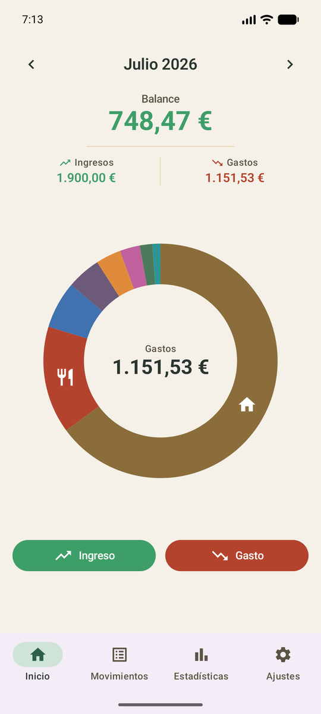

### Pantalla principal
Donut de gastos por categoría dibujado con `Canvas` de Compose e **interactivo**: al mantener
pulsada una porción se resuelve la categoría por *hit-testing* (ángulo + radio) y se muestran
sus datos en el centro. Balance, ingresos y gastos del mes se calculan de forma **reactiva**
con `Flow` + `StateFlow`, con navegación entre meses.

<br clear="all">

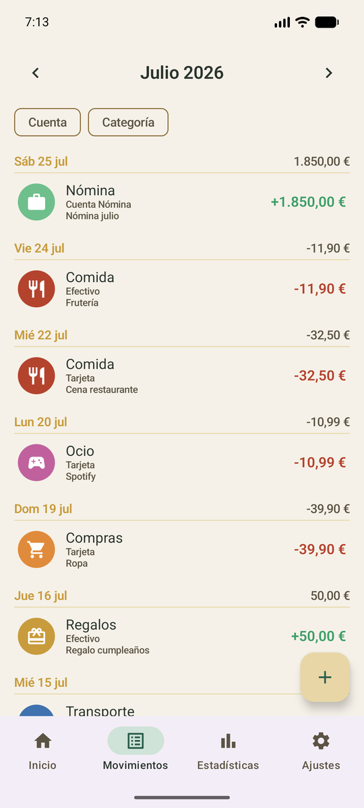

### Movimientos
Listado observado desde **Room con `Flow`**, agrupado por día y **filtrable** por mes, cuenta
o categoría. Alta, edición y borrado de ingresos, gastos y transferencias, con validación en
el `ViewModel` y estado de UI inmutable (`StateFlow`).

<br clear="all">

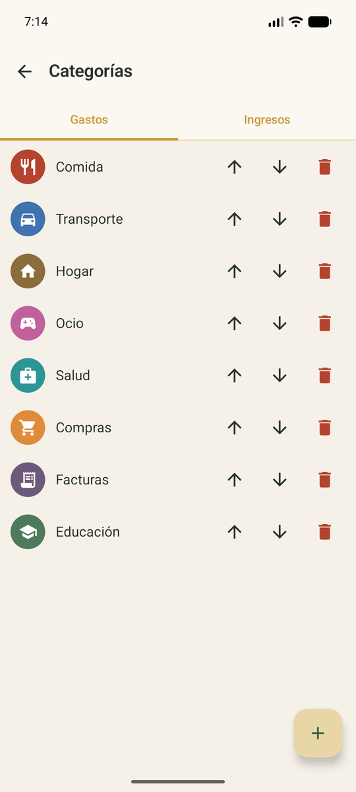

### Categorías ilimitadas
Categorías sin límite, cada una con icono (**Material Symbols**) y color, persistidas en Room
y **reordenables**. Nada de muros de pago: justo lo que otras apps cobran, aquí es gratis.

<br clear="all">

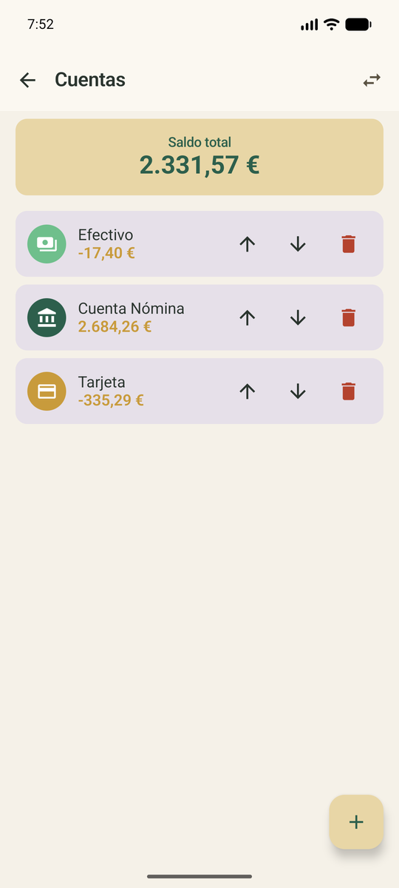

### Cuentas y transferencias
Múltiples cuentas con **saldo calculado mediante agregación SQL** (inicial + ingresos − gastos
± transferencias), saldo total combinado y transferencias entre cuentas modeladas como un tipo
de transacción propio.

<br clear="all">

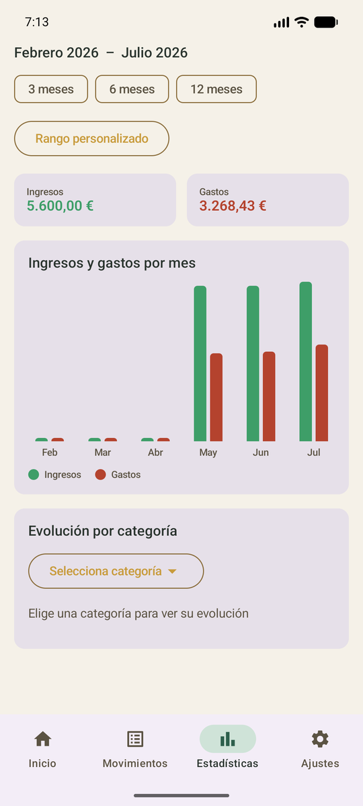

### Estadísticas
Comparativa de ingresos y gastos **mes a mes**, evolución de una categoría concreta y filtro
por **rango de fechas** personalizado. Agregaciones calculadas en el repositorio y gráficos
dibujados con `Canvas`.

<br clear="all">

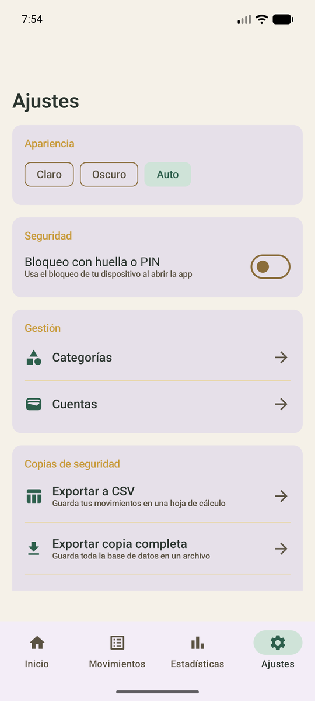

### Copias de seguridad y privacidad
Exportación a **CSV** y backup/restauración de la base de datos completa vía **Storage Access
Framework** en Android y el selector nativo de documentos en iOS. Bloqueo opcional con la
biometría o el código del dispositivo. `allowBackup=false` en Android y datos iOS excluidos del
backup automático.

<br clear="all">

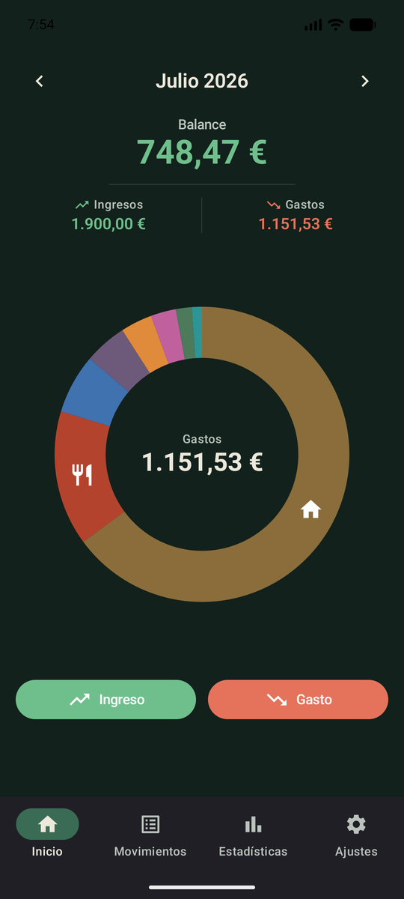

### Tema claro y oscuro
**Material 3** con un esquema de color propio inspirado en la antigua moneda de 500 pesetas.
Modo claro, oscuro o automático según el sistema, con las preferencias guardadas en **DataStore**.

<br clear="all">

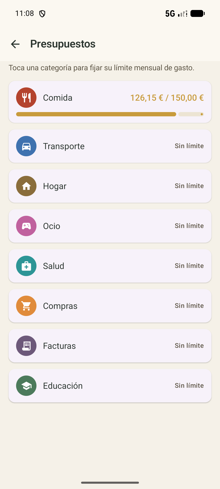

### Presupuestos por categoría
Fija un **límite mensual de gasto** por categoría (entidad `Budget` en Room con clave foránea).
El gasto del mes se calcula por agregación SQL y se muestra con una **barra de progreso tipo
semáforo** (verde → ocre → terracota). Al superar el 80 %, la pantalla principal enseña un aviso
discreto, sin diálogos ni notificaciones que interrumpan.

<br clear="all">

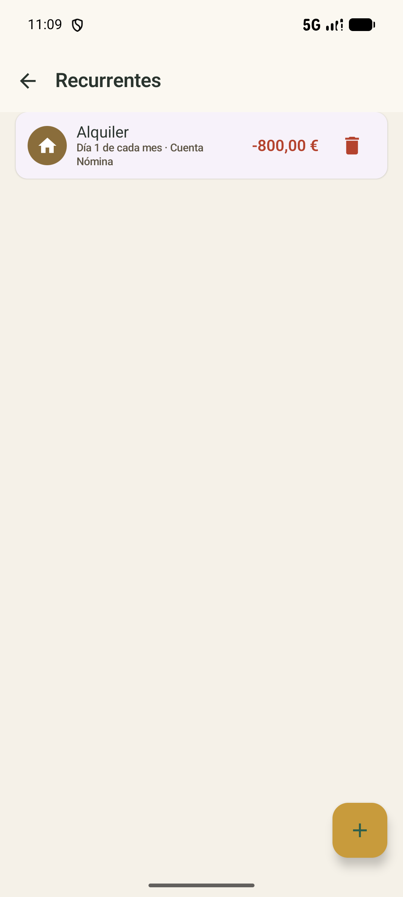

### Movimientos recurrentes
Reglas para el alquiler, las suscripciones o la nómina que **se apuntan solas**. Sin `WorkManager`
ni alarmas: al abrir la app se generan todas las ocurrencias pendientes desde la última vez
(aunque hayan pasado meses), con un aviso no intrusivo y **opción de deshacer** cada apunte.

<br clear="all">

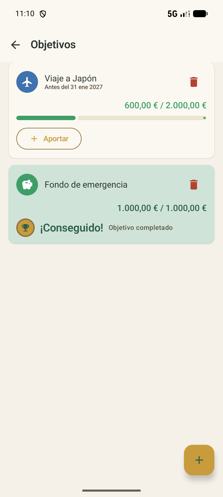

### Objetivos de ahorro
Metas de ahorro (entidad `SavingsGoal`) con **aportaciones manuales** y barra de progreso con el
mismo color semáforo que los presupuestos. Al llegar al 100 % la tarjeta muestra un estado de
celebración discreto, acorde a la identidad visual de la app.

<br clear="all">

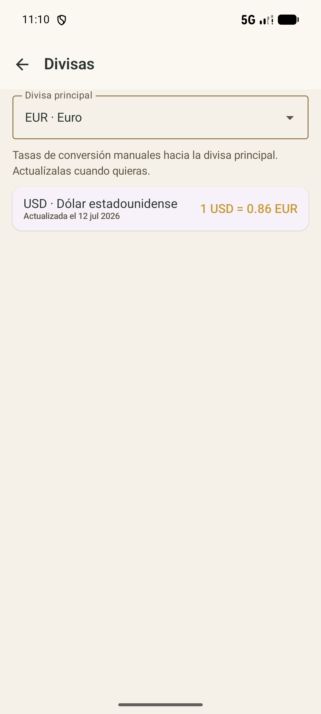

### Multi-divisa sin internet
Cada cuenta tiene su **propia divisa** y muestra su saldo en ella. Como no hay red, defines a mano
las **tasas de conversión** hacia tu divisa principal y las actualizas cuando quieras. El saldo
total combinado se marca como aproximado (`≈`) con la fecha de la última tasa usada, para que
quede claro que no es un cambio en tiempo real.

<br clear="all">

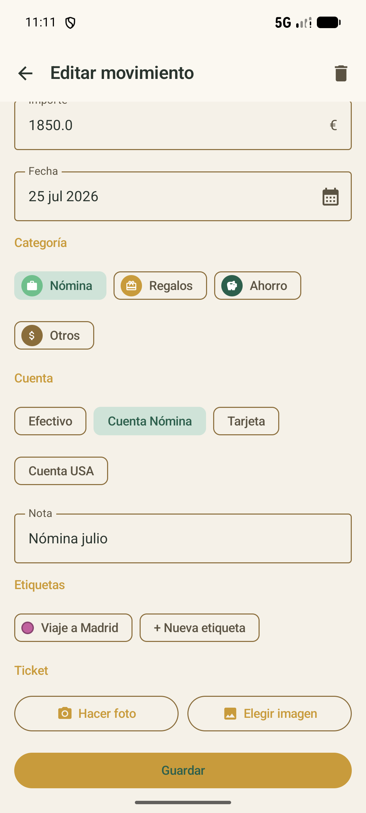

### Etiquetas y foto de ticket
**Etiquetas** (relación muchos-a-muchos con los movimientos) para agrupar gastos que cruzan
categorías —un viaje, un proyecto— con filtro propio y un total por etiqueta en estadísticas.
Además, adjunta la **foto del ticket** a cualquier movimiento: se captura con el selector nativo
de cada plataforma, se comprime y se guarda solo en el almacenamiento privado de la app.

<br clear="all">

## 🧱 Arquitectura y stack

- **Lenguaje / UI:** Kotlin Multiplatform · Compose Multiplatform · Material 3
- **Arquitectura:** MVVM en capas `data` / `domain` / `ui`, estado con `StateFlow`
- **Código compartido:** dominio, Room, repositorios, ViewModels, navegación y las 17 pantallas
- **Persistencia:** Room KMP (SQLite) como única fuente de datos · DataStore para preferencias
- **Asincronía:** Coroutines + Flow (datos reactivos de extremo a extremo)
- **Dependencias:** contenedor de aplicación compartido con instancias de sesión
- **Navegación:** Navigation Compose
- **Integración nativa:** BiometricPrompt/LocalAuthentication, selectores de documentos y cámara
- **Build:** Gradle + Kotlin DSL · host SwiftUI/Xcode · Android `minSdk 26`, `targetSdk 36` / iOS 14+

```
shared/src/commonMain/kotlin/com/pesetas/
├── data/      # Room, DAOs, repositorios, tickets y backup
├── domain/    # modelos y contratos de repositorio
└── ui/        # tema, navegación, ViewModels y pantallas compartidas

shared/src/androidMain/  # biometría, archivos, cámara y almacenamiento Android
shared/src/iosMain/      # LocalAuthentication, UIKit y almacenamiento iOS
app/                     # launcher Android
iosApp/                  # host SwiftUI y proyecto Xcode
```

## 🔒 Privacidad

- **Sin permiso de INTERNET** en el manifiesto Android y sin clientes de red en el código compartido.
- Sin cuentas, sin registro, sin analítica ni SDKs de terceros.
- La base de datos vive en el almacenamiento privado de la app; los backups los controlas tú.

## 🚀 Compilación e instalación

**Usar la app (APK ya compilado):** descarga el APK desde [`releases/`](releases/) e instálalo
(te pedirá permitir *orígenes desconocidos*).

**Compilar Android desde el código:**

```bash
git clone https://github.com/cpergo/El-pesetero.git
cd El-pesetero
./gradlew assembleDebug        # APK de depuración
./gradlew installDebug         # instala en el dispositivo conectado
```

Requiere Android Studio (JDK 17 o posterior incluido) y un dispositivo o emulador con Android 8.0
(API 26) o superior.

**Compilar iOS:** abre `iosApp/iosApp.xcodeproj` con Xcode, selecciona un simulador o dispositivo y
ejecuta el esquema `iosApp`. El proyecto invoca Gradle automáticamente para generar el framework
Kotlin adecuado. Para probar la lógica compartida desde terminal:

```bash
./gradlew :shared:iosSimulatorArm64Test
```

Requiere macOS, Xcode 26 y un destino con iOS 14 o posterior. Para instalar en un dispositivo o
distribuir la app hay que configurar el equipo de firma en Xcode.

## 🤝 Contribuir

Es un proyecto nuevo y las contribuciones son **bienvenidas**: abre un *issue* para proponer
ideas o reportar fallos, o manda un *pull request*. Toda mejora suma.

## 📬 Contacto

<div align="center">

<a href="mailto:gomezperezcristian2004@gmail.com"></a>
<a href="https://github.com/cpergo"></a>
<a href="https://www.linkedin.com/in/cristian-p%C3%A9rez-356961262"></a>

</div>

## 📄 Licencia

Distribuido bajo licencia **MIT**. Consulta el archivo [LICENSE](LICENSE).

<div align="center">
<sub>Hecho con cariño para quien quiere controlar su dinero sin pagar por ello.</sub>
</div>
