<div align="center">


<p><strong>Control de gastos para Android e iOS — 100 % local, de código abierto y sin límites.</strong><br>
Sin cuentas, sin servidores, sin anuncios. Tus datos nunca salen de tu teléfono.</p>

<p>


</p>

<p>
<a href="https://github.com/cpergo/El-pesetero/raw/main/releases/el-pesetero-1.2.0.apk"><strong>⬇️&nbsp;Descargar APK</strong></a>
&nbsp;·&nbsp;
<a href="https://cpergo.github.io/El-pesetero/"><strong>🌐&nbsp;Web</strong></a>
</p>

</div>

---

**El pesetero** es una app para **Android e iOS** con la que llevar el control de tus gastos e
ingresos. La misma app, el mismo código y la misma pantalla en los dos teléfonos. Todo se guarda
**solo en tu dispositivo** y **sin ningún permiso de red**: es técnicamente incapaz de transmitir
tus datos a ninguna parte.

## ✨ Características

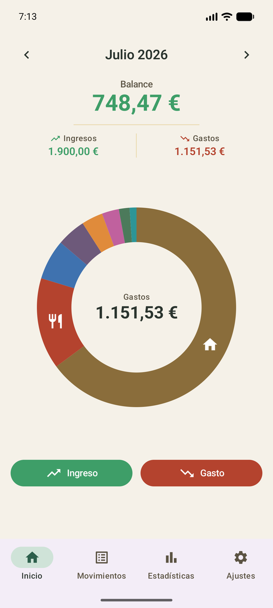

### Pantalla principal
Un donut con tus gastos del mes repartidos por categoría, **interactivo**: mantén pulsada una
porción y verás a qué categoría pertenece y cuánto llevas gastado. Balance, ingresos y gastos se
actualizan solos, y puedes moverte entre meses.

<br clear="all">

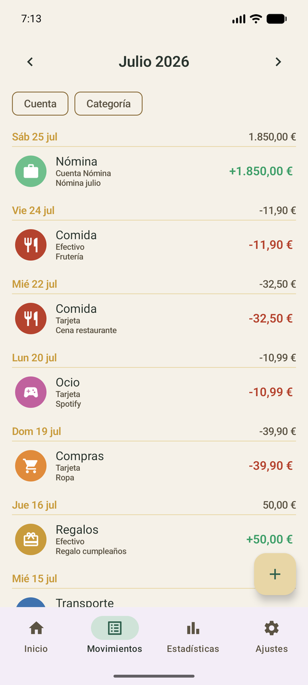

### Movimientos
Todos tus apuntes agrupados por día y **filtrables** por mes, cuenta o categoría. Añade, edita o
borra ingresos, gastos y transferencias en un par de toques.

<br clear="all">

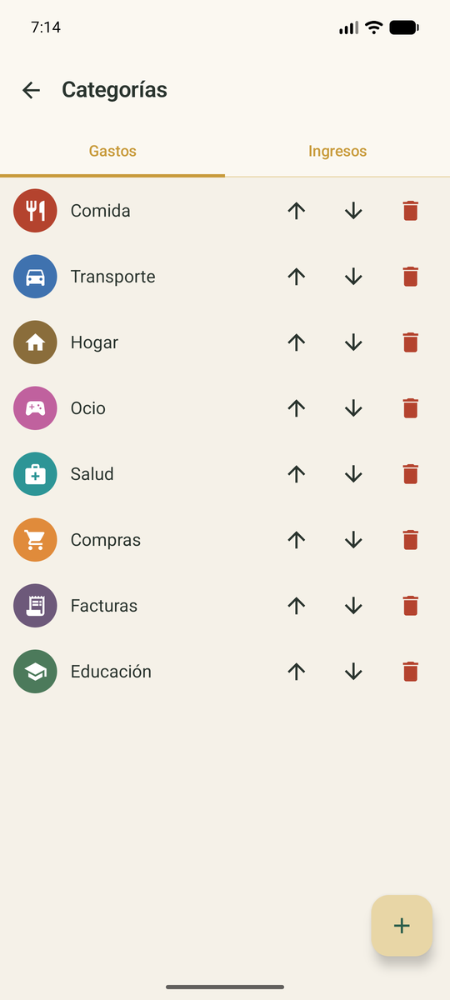

### Categorías ilimitadas
Las categorías que quieras, cada una con su icono y su color, y **reordenables** a tu gusto. Nada
de muros de pago: justo lo que otras apps cobran, aquí es gratis.

<br clear="all">

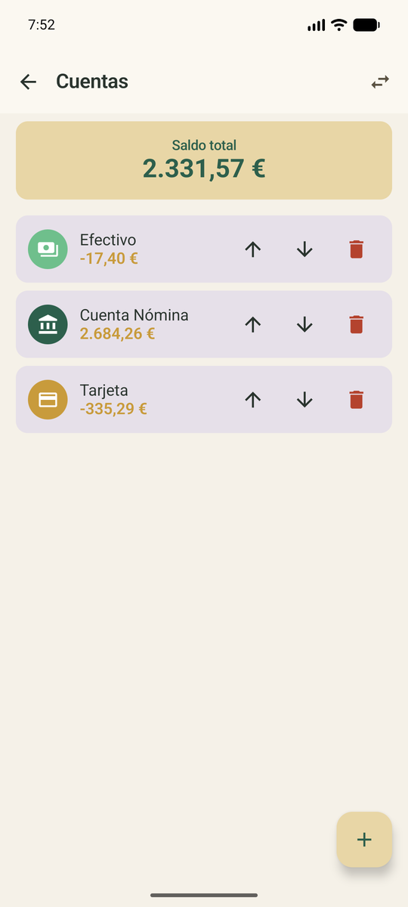

### Cuentas y transferencias
Tantas cuentas como necesites —banco, efectivo, ahorros— con su saldo siempre al día, el total
combinado y transferencias entre ellas sin descuadrar nada.

<br clear="all">

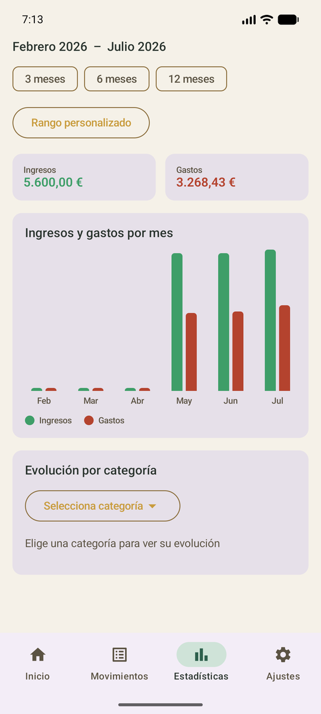

### Estadísticas
Compara ingresos y gastos **mes a mes**, mira cómo evoluciona una categoría concreta y acota el
periodo con un **rango de fechas** a medida.

<br clear="all">

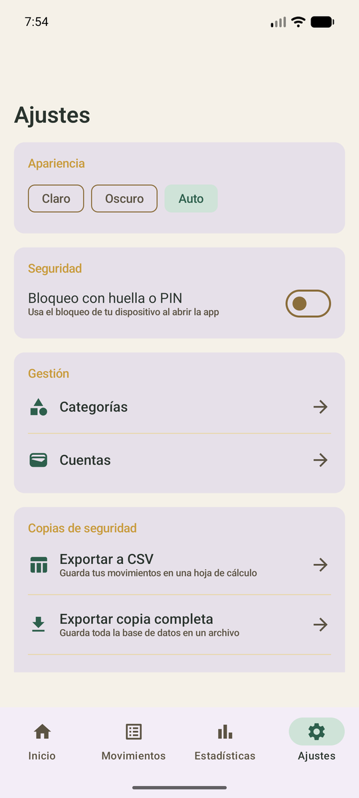

### Copias de seguridad y privacidad
Exporta a **CSV** o haz una copia completa de tus datos, y guárdala donde tú decidas con el
selector de archivos de tu móvil. Puedes **bloquear la app** con la huella, la cara o el código del
dispositivo, y tus datos quedan fuera de las copias automáticas del sistema.

<br clear="all">

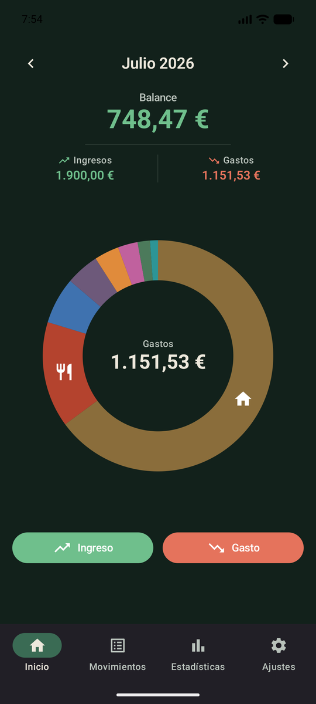

### Tema claro y oscuro
Un diseño propio inspirado en la antigua moneda de 500 pesetas. Modo claro, oscuro o automático
según el sistema.

<br clear="all">

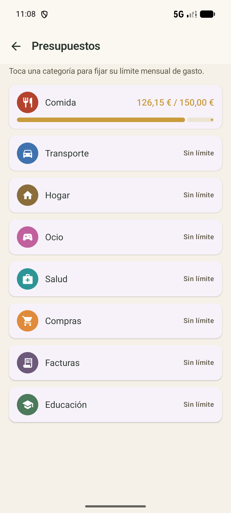

### Presupuestos por categoría
Fija un **límite mensual** por categoría y la barra te lo dice de un vistazo con colores de
semáforo (verde → ocre → terracota). Al pasar del 80 % aparece un aviso discreto en la pantalla
principal, sin diálogos ni notificaciones que molesten.

<br clear="all">

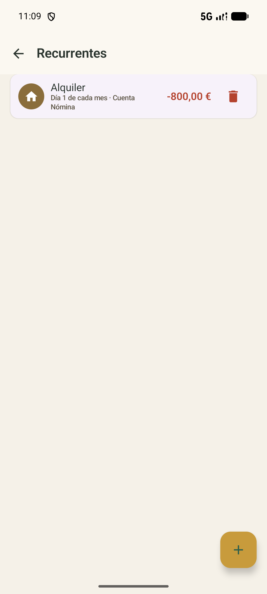

### Movimientos recurrentes
El alquiler, las suscripciones o la nómina **se apuntan solos**. Al abrir la app se ponen al día
todos los apuntes pendientes, aunque hayan pasado meses, y siempre puedes **deshacerlos**.

<br clear="all">

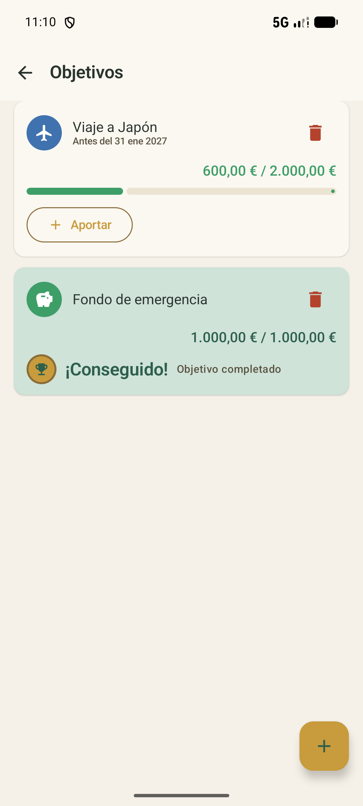

### Objetivos de ahorro
Marca una meta —un viaje, un colchón— y ve añadiendo aportaciones. La barra de progreso usa los
mismos colores que los presupuestos y celebra con discreción cuando llegas al 100 %.

<br clear="all">

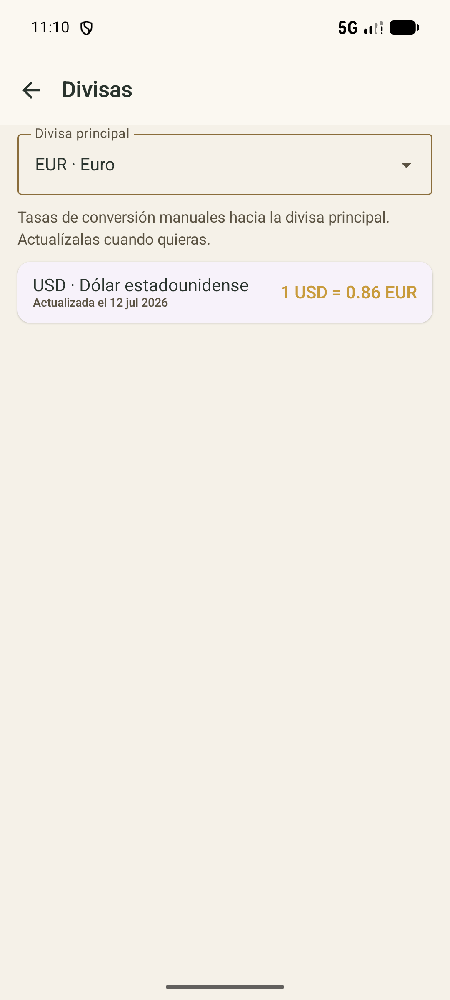

### Multi-divisa sin internet
Cada cuenta puede estar en **su propia moneda**. Como la app no se conecta a ningún sitio, las
**tasas de cambio las pones tú** y las actualizas cuando quieras. El total combinado se muestra
como aproximado (`≈`) con la fecha de la última tasa, para que quede claro que no es tiempo real.

<br clear="all">

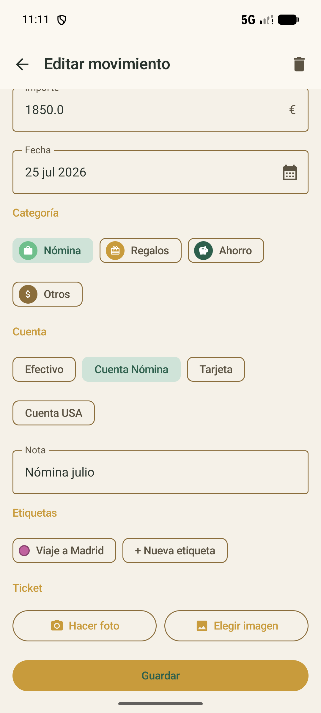

### Etiquetas y foto de ticket
Las **etiquetas** agrupan gastos que cruzan categorías —un viaje, una reforma, un proyecto— con su
propio filtro y su total en estadísticas. Y a cualquier movimiento puedes adjuntarle la **foto del
ticket**: se toma con la cámara o la galería del móvil y se queda guardada solo dentro de la app.

<br clear="all">

## 🚀 Instalación

**Android:** descarga el APK desde [`releases/`](releases/) e instálalo (te pedirá permitir
*orígenes desconocidos*).

**iOS:** de momento se instala compilando el proyecto desde el código.

<details>
<summary><strong>Compilar desde el código</strong></summary>

```bash
git clone https://github.com/cpergo/El-pesetero.git
cd El-pesetero
```

**Android** — con Android Studio y un dispositivo o emulador con Android 8.0 o superior:

```bash
./gradlew installDebug
```

**iOS** — con macOS, Xcode y un destino con iOS 14 o superior. Puedes abrir
`iosApp/iosApp.xcodeproj` y pulsar `⌘R`, o usar los atajos del `Makefile`:

```bash
make            # lista todos los comandos y variables disponibles
make ios        # compila, instala y abre la app en el simulador
make ios-device # lo mismo en un iPhone conectado
```

</details>

## 🤝 Contribuir

Es un proyecto nuevo y las contribuciones son **bienvenidas**: abre un *issue* para proponer
ideas o reportar fallos, o manda un *pull request*. Toda mejora suma.

## 📬 Contacto

<div align="center">

<a href="mailto:gomezperezcristian2004@gmail.com"></a>
<a href="https://github.com/cpergo"></a>
<a href="https://www.linkedin.com/in/cristian-p%C3%A9rez-356961262"></a>

</div>

## 📄 Licencia

Distribuido bajo licencia **MIT**. Consulta el archivo [LICENSE](LICENSE).

<div align="center">
<sub>Hecho con cariño para quien quiere controlar su dinero sin pagar por ello.</sub>
</div>
